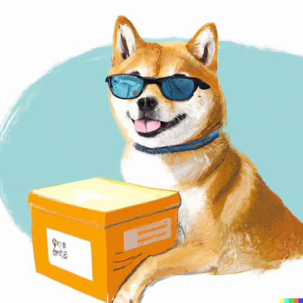

# MatchHostFsOwner: solving the Docker host filesystem owner matching problem

MatchHostFsOwner solves [the Docker host filesystem owner matching problem](https://www.joyfulbikeshedding.com/blog/2021-03-15-docker-and-the-host-filesystem-owner-matching-problem.html). It ensures that the container's UID/GID matches the host's. This way:

 * Containers avoid "permission denied" errors when accessing host files.
 * You can avoid running containers as root in an attempt to bypass permission problems.
    - Containers running as root create root-owned files on the host, which may be unreadable by the host's user. This gives extra headaches!
    - Running as root is insecure. Avoid it when possible!

**Table of contents**

 - [What is the Docker host filesystem owner matching problem?](#what-is-the-docker-host-filesystem-owner-matching-problem)
 - [How does MatchHostFsOwner solve the problem?](#how-does-matchhostfsowner-solve-the-problem)
 - [Basic usage](#basic-usage)
    - [Usage mode 1: start container without root privileges](#usage-mode-1-start-container-without-root-privileges)
      - [Container image build instructions](#container-image-build-instructions)
      - [Container start instructions](#container-start-instructions)
        - [Docker CLI](#docker-cli)
        - [Kubernetes](#kubernetes)
    - [Usage mode 2: start container with root privileges](#usage-mode-2-start-container-with-root-privileges)
      - [Container image build instructions](#container-image-build-instructions-1)
      - [Container start instructions](#container-start-instructions-1)
        - [Docker CLI](#docker-cli-1)
        - [Docker Compose](#docker-compose)
        - [Kubernetes](#kubernetes-1)
 - [Advanced usage](#advanced-usage)
    - [Custom user/group account name](#custom-usergroup-account-name)
    - [Combining other entrypoint programs with MatchHostFsOwner](#combining-other-entrypoint-programs-with-matchhostfsowner)
      - [Wrapping MatchHostFsOwner around other entrypoint programs](#wrapping-matchhostfsowner-around-other-entrypoint-programs)
      - [Wrapping other entrypoint programs around MatchHostFsOwner](#wrapping-other-entrypoint-programs-around-matchhostfsowner)
    - [Hooks](#hooks)
      - [Don't hardcode app account name or home directory!](#dont-hardcode-app-account-name-or-home-directory)
 - [Special considerations](#special-considerations)
    - [Security of setuid root bit](#security-of-setuid-root-bit)
    - [Chowning of home directory](#chowning-of-home-directory)
      - [Disabling chowning](#disabling-chowning)
      - [Chowning only selected files](#chowning-only-selected-files)
 - [Troubleshooting](#troubleshooting)
 - [Development](#development)

## What is the Docker host filesystem owner matching problem?

> This is a quick summary. See [the article](https://www.joyfulbikeshedding.com/blog/2021-03-15-docker-and-the-host-filesystem-owner-matching-problem.html) for a full explanation.

When a container accesses files on the host via host path mounts, one may run into permission problems.

 * If the container runs as a non-root user, one may encounter "permission denied" errors.
 * If the container runs as root, this is a security risk. Furthermore, the host directory may end up with a bunch of root-owned files, which may be unreadable by the host user.

These issues happen because apps in the container run as a different user than the host user. These issues plague any container that interacts with host files. For example, development environment containers tend to read source files on the host and write to log files on the host.

There are various strategies to solve this problem, but they are all either non-trivial (requiring complex logic) and/or have significant caveats (e.g. requiring privileged containers). See the article to learn more.

## How does MatchHostFsOwner solve the problem?

MatchHostFsOwner implements solution strategy number 1 [described in the article](https://www.joyfulbikeshedding.com/blog/2021-03-15-docker-and-the-host-filesystem-owner-matching-problem.html). It ensures that the container runs as the same user (UID/GID) as the host's user. In short, it:

 1. ...modifies a user account inside the container so that the account's UID/GID matches that of the host user.
 2. ...executes the actual container command as the aforementioned user account (instead of, e.g., letting it execute as root).

This strategy is easier said than done, and the article documents the many caveats involved with this strategy. Fortunately, MatchHostFsOwner is here to help because it addresses all these caveats, so you don't have to.

## Basic usage

Core concepts to understand:

 - **It's an entrypoint** — Install MatchHostFsOwner as the container entrypoint program. It [should be the first program to run in the container](#combining-other-entrypoint-programs-with-matchhostfsowner). When it runs, modifies the container's environment, then executes the next command with the proper UID/GID.

 - **It requires host user input** — when starting a container, the host user must tell MatchHostFsOwner what the host user's UID/GID is. How the user passes this information depends on what tool the user uses to start the container (e.g., Docker CLI, Docker Compose, Kubernetes, etc).

 - **It requires an extra user account in the container** — MatchHostFsOwner tries to execute the next command under a user account in the container whose UID equals the host user's UID. If no such account exists (which is common), then MatchHostFsOwner will take a specific account and modify its UID/GID to match that of the host user.

   The account MatchHostFsOwner will take and modify is called the **"app account"**. MatchHostFsOwner won't create this account for you — you have to supply it. It won't always be used, but often it will.

   By default, MatchHostFsOwner assumes that the app account is named `app`. But this is [customizable](#custom-usergroup-account-name).

 - **It requires root privileges** — MatchHostFsOwner itself requires root privileges to modify the container's environment. It drops these privileges later before executing the next command.

   How exactly MatchHostFsOwner is granted root privileges depends on how one is supposed to start the container. This brings us to the two _usage modes_.

### Usage mode 1: start container without root privileges

This mode is most suitable for starting the container without root privileges. For example:

 - When your Dockerfile sets a default user account using `USER`.
 - When your container is supposed to be started with `docker run --user`.
 - When your Kubernetes spec makes use of securityContext's `runAsUser`/`runAsGroup`.

In this mode, you must grant MatchHostFsOwner the setuid root bit. MatchHostFsOwner drops its setuid root bit as soon as possible after it has done its work.

Limitations of this mode:

 - The container cannot be started a second time (e.g., using `docker stop` and then `docker start`). Upon starting the container for the second time, MatchHostFsOwner no longer has the setuid root bit, so it won't be able to do its job. Thus, mode 1 is only useful for ephemeral containers.
 - Incompatible with Docker Compose because it may start the container a second time.
 - Requires that the container filesystem in which MatchHostFsOwner is located, to be writable. Because MatchHostFsOwner must be able to drop the setuid root bit. Thus, you cannot run the container in read-only mode (e.g., `docker run --read-only`).

#### Container image build instructions

 1. Create an account named `app` in your container. Set it up as the default account for the container. [A different account name is also possible](#custom-usergroup-account-name).
 2. Place the MatchHostFsOwner executable in a root-owned directory (e.g., `/sbin`) and ensure that the executable is owned by root, and has the setuid root bit.
 3. Set up the MatchHostFsOwner executable as the container entrypoint.

Example:

~~~dockerfile
FROM ubuntu:22.04

# Install MatchHostFsOwner. Replace X.X.X with an actual version.
# See https://github.com/FooBarWidget/matchhostfsowner/releases
ADD https://github.com/FooBarWidget/matchhostfsowner/releases/download/vX.X.X/matchhostfsowner-X.X.X-x86_64-linux.gz /sbin/matchhostfsowner.gz
RUN gunzip /sbin/matchhostfsowner.gz && \
  chown root: /sbin/matchhostfsowner && \
  chmod +x,+s /sbin/matchhostfsowner
RUN addgroup --gid 9999 app && \
  adduser --uid 9999 --gid 9999 --disabled-password --gecos App app
## Or, on RHEL-based images:
# RUN groupadd --gid 9999 app && \
#   useradd --uid 9999 --gid 9999 app
## Or, on Alpine-based images:
# RUN addgroup -g 9999 app && \
#   adduser -G app -u 9999 -D app
USER app

ENTRYPOINT ["/sbin/matchhostfsowner"]
~~~

~~~bash
docker build . -t my-example-image
~~~

#### Container start instructions

##### Docker CLI

Set `--user` to the host user's UID and GID. MatchHostFsOwner will recognize that UID/GID as being the host user's. Example:

~~~bash
docker run --user "$(id -u):$(id -g)" my-example-image id -a
# Output (assuming host UID/GID is 501/20):
# uid=501(app) gid=20(app) groups=20(app)
~~~

##### Kubernetes

Set `spec.securityContext.runAsUser` and `spec.securityContext.runAsGroup` to appropriate values. MatchHostFsOwner will recognize that UID/GID as being the host user's. Example:

~~~yaml
apiVersion: v1
kind: Pod
metadata:
  name: matchhostfsowner-demo
spec:
  securityContext:
    runAsUser: <HOST UID HERE>
    runAsGroup: <HOST GID HERE>
  volumes:
    - name: host
      hostPath:
        path: /some-path-on-the-host
        type: Directory
  containers:
    - name: matchhostfsowner-demo
      image: busybox
      command: ["touch", "/host/foo.txt"]
      volumeMounts:
        - name: host
          mountPath: /host
~~~

### Usage mode 2: start container with root privileges

In this mode, MatchHostFsOwner obtains root privileges through the fact that one starts the container with root privileges. MatchHostFsOwner drops its root privileges as soon as possible after it has done its work.

This mode is most suitable if any of the following is applicable:

 - You're using Docker Compose.
 - The container could be started a second time, as happens with, e.g., Docker Compose.
 - The container filesystem in which MatchHostFsOwner is located is read-only.

#### Container image build instructions

 1. Create an account named `app` in your container. [A different account name is also possible](#custom-usergroup-account-name).
 2. Place the MatchHostFsOwner executable in a root-owned directory (e.g., `/sbin`) and ensure that the executable is owned by root.
 3. Set up the MatchHostFsOwner executable as the container entrypoint.
 4. **Don't** set a default user account with `USER`.

Example:

~~~dockerfile
FROM ubuntu:22.04

# Install MatchHostFsOwner. Replace X.X.X with an actual version.
# See https://github.com/FooBarWidget/matchhostfsowner/releases
ADD https://github.com/FooBarWidget/matchhostfsowner/releases/download/vX.X.X/matchhostfsowner-X.X.X-x86_64-linux.gz /sbin/matchhostfsowner.gz
RUN gunzip /sbin/matchhostfsowner.gz && \
  chown root: /sbin/matchhostfsowner && \
  chmod +x /sbin/matchhostfsowner
RUN addgroup --gid 9999 app && \
  adduser --uid 9999 --gid 9999 --disabled-password --gecos App app
## Or, on RHEL-based images:
# RUN groupadd --gid 9999 app && \
#   useradd --uid 9999 --gid 9999 app
## Or, on Alpine-based images:
# RUN addgroup -g 9999 app && \
#   adduser -G app -u 9999 -D app

ENTRYPOINT ["/sbin/matchhostfsowner"]
~~~

~~~bash
docker build . -t my-example-image
~~~

#### Container start instructions

##### Docker CLI

Set the environment variables `MHF_HOST_UID` and `MHF_HOST_GID` to the host user's UID/GID. Example:

~~~bash
docker run -e "MHF_HOST_UID=$(id -u)" -e "MHF_HOST_GID=$(id -g)" my-example-image id -a
# Output (assuming host UID/GID is 501/20):
# uid=501(app) gid=20(app) groups=20(app)
~~~

##### Docker Compose

In your `docker-compose.yml`, ensure you pass the `UID` and `GID` CLI environment variables, into the corresponding containers' environment variables as `MHF_HOST_UID` and `MHF_HOST_GID`:

~~~yaml
services:
  foo:
    ...
    environment:
      - MHF_HOST_UID=${UID}
      - MHF_HOST_GID=${GID}
~~~

Then every time the user runs `docker-compose up`, the user must pass the `UID` and `GID` environment variables. These are to be set to the user's own UID/GID:

~~~bash
export UID  # The shell already sets $UID as a read-only variable but does not export it
export GID="$(id -g)"
docker-compose up
~~~

> **Tip**: Remembering to set \$UID/\$GID every time can be a bit inconvenient. The user can use [direnv](https://direnv.net/) to automate this. For example, in the project's `.envrc`:
>
> ~~~bash
> export UID  # The shell already sets $UID as a read-only variable but does not export it
> export GID="$(id -g)"
> ~~~

##### Kubernetes

Set the container environment variables `MHF_HOST_UID` and `MHF_HOST_GID` to appropriate values. Example:

~~~yaml
apiVersion: v1
kind: Pod
metadata:
  name: security-context-demo
spec:
  securityContext:
    runAsUser: <HOST UID HERE>
    runAsGroup: <HOST GID HERE>
  volumes:
    - name: host
      hostPath:
        path: /some-path-on-the-host
        type: Directory
  containers:
    - name: matchhostfsowner-demo
      image: busybox
      command: ["touch", "/host/foo.txt"]
      env:
        - name: MHF_HOST_UID
          value: "<HOST UID HERE>"
        - name: MHF_HOST_GID
          value: "<HOST GID HERE>"
      volumeMounts:
        - name: host
          mountPath: /host
~~~

## Advanced usage

### Custom user/group account name

If you want MatchHostFsOwner to use a different user account or group account in the container, then you can customize this with the `app_account` and `app_group` config options.

Inside the container, create a file /etc/matchhostfsowner/config.yml:

~~~yaml
app_account: <USER ACCOUNT NAME HERE>
app_group: <GROUP ACCOUNT NAME HERE>
~~~

Make sure to protect this file and directory appropriately:

~~~bash
chown -R root: /etc/matchhostfsowner && \
chmod 700 /etc/matchhostfsowner && \
chmod 600 /etc/matchhostfsowner/*
~~~

### Combining other entrypoint programs with MatchHostFsOwner

You can combine other entrypoint programs with MatchHostFsOwner in three ways:

 * Wrapping MatchHostFsOwner around other entrypoint programs.
    - This runs other entrypoint programs under a normal user account.
    - By the time other entrypoint programs run, MatchHostFsOwner has already done its job, so it's fine for other entrypoint programs to access host files.
 * Wrapping MatchHostFsOwner around other entrypoint programs.
    - Under usage mode 1, this runs other entrypoint programs under a normal user account.
    - Under usage mode 2, this runs other entrypoint programs as root.
    - By the time other entrypoint programs run, MatchHostFsOwner has *not* done its job. So be careful with accessing host files in those entrypoint programs, especially because the effective user is different for each usage mode.
 * By using [hooks](#hooks) (**recommended**).
    - Hooks are always run as root, regardless of usage mode.
    - Hooks are run after MatchHostFsOwner has done most of its work, but before MatchHostFsOwner has dropped its privileges.

#### Wrapping MatchHostFsOwner around other entrypoint programs

MatchHostFsOwner works by executing the command passed through its arguments after MatchHostFsOwner has done its work. Thus, you can wrap other entrypoint programs by passing them (and their arguments) to MatchHostFsOwner as arguments.

For example let's say that your container currently has an entrypoint program that prints "hello world", and that the container's main command touches a host-mounted file, like this:

~~~dockerfile
FROM ubuntu:22.04

ADD my_entrypoint.sh /

ENTRYPOINT ["/my_entrypoint.sh"]
CMD ["touch", "/host/foo.txt"]
~~~

my_entrypoint.sh looks like this:

~~~bash
#!/usr/bin/env sh
echo "Hello world from entrypoint"
exec "$@"
~~~

You can combine it with MatchHostFsOwner like this:

~~~dockerfile
FROM ubuntu:22.04

# Install MatchHostFsOwner. Replace X.X.X with an actual version.
# See https://github.com/FooBarWidget/matchhostfsowner/releases
ADD https://github.com/FooBarWidget/matchhostfsowner/releases/download/vX.X.X/matchhostfsowner-X.X.X-x86_64-linux.gz /sbin/matchhostfsowner.gz
RUN gunzip /sbin/matchhostfsowner.gz && \
  chown root: /sbin/matchhostfsowner && \
  chmod +x,+s /sbin/matchhostfsowner
RUN addgroup --gid 9999 app && \
  adduser --uid 9999 --gid 9999 --disabled-password --gecos App app
USER app

ADD my_entrypoint.sh /

# Wrap MatchHostFsOwner around my_entrypoint.sh
ENTRYPOINT ["/sbin/matchhostfsowner", "/my_entrypoint.sh"]
CMD ["touch", "/host/foo.txt"]
~~~

#### Wrapping other entrypoint programs around MatchHostFsOwner

Be aware when doing this. Your other entrypoint programs shouldn't access host files, because at that point MatchHostFsOwner hasn't done its job yet. If that's not an issue, then read on.

Let's say that your container currently has an entrypoint program that prints "hello world", and that the container's main command touches a host-mounted file, like this:

~~~dockerfile
FROM ubuntu:22.04

ADD my_entrypoint.sh /

ENTRYPOINT ["/my_entrypoint.sh"]
CMD ["touch", "/host/foo.txt"]
~~~

my_entrypoint.sh looks like this:

~~~bash
#!/usr/bin/env sh
echo "Hello world from entrypoint"
exec "$@"
~~~

You can combine it with MatchHostFsOwner like this:

~~~dockerfile
FROM ubuntu:22.04

# Install MatchHostFsOwner. Replace X.X.X with an actual version.
# See https://github.com/FooBarWidget/matchhostfsowner/releases
ADD https://github.com/FooBarWidget/matchhostfsowner/releases/download/vX.X.X/matchhostfsowner-X.X.X-x86_64-linux.gz /sbin/matchhostfsowner.gz
RUN gunzip /sbin/matchhostfsowner.gz && \
  chown root: /sbin/matchhostfsowner && \
  chmod +x,+s /sbin/matchhostfsowner
RUN addgroup --gid 9999 app && \
  adduser --uid 9999 --gid 9999 --disabled-password --gecos App app
USER app

ADD my_entrypoint.sh /

# Wrap my_entrypoint.sh around MatchHostFsOwner
ENTRYPOINT ["/my_entrypoint.sh", "/sbin/matchhostfsowner"]
CMD ["touch", "/host/foo.txt"]
~~~

### Hooks

After MatchHostFsOwner has done most of its work, but before it has dropped privileges and executed the next command, MatchHostFsOwner will run *hooks*. Hooks are useful if you want to perform additional setup at this point. For example, if your container already had an entrypoint script, then should convert that into a hook.

A hook is any executable file in the container inside `/etc/matchhostfsowner/hooks.d`. Hooks are always run as root. Hooks are run serially, in alphabetical order. Hooks must all succeed: if any hook exits with a non-successful code, then MatchHostFsOwner aborts with an error.

The following environment variables are passed to hooks:

 * `MHF_HOST_UID` — the host user's UID, i.e., the UID of the container user account that we will use.
 * `MHF_HOST_GID` — the host user's GID, i.e., the GID of the container group account that we will use.
 * `MHF_HOST_USER` — the name of the container user account that we will use.
 * `MHF_HOST_GROUP` — the name of the container group account that we will use.
 * `MHF_HOST_HOME` — the home directory of the container user account that we will use.

#### Hooks example

Let's say that your container currently has an entrypoint program that prints "hello world", and that the container's main command touches a host-mounted file, like this:

~~~dockerfile
FROM ubuntu:22.04

ADD my_entrypoint.sh /

ENTRYPOINT ["/my_entrypoint.sh"]
CMD ["touch", "/host/foo.txt"]
~~~

my_entrypoint.sh looks like this:

~~~bash
#!/usr/bin/env sh
echo "Hello world from entrypoint"
exec "$@"
~~~

Let's convert this example into one that uses hooks:

~~~dockerfile
FROM ubuntu:22.04

# Install MatchHostFsOwner. Replace X.X.X with an actual version.
# See https://github.com/FooBarWidget/matchhostfsowner/releases
ADD https://github.com/FooBarWidget/matchhostfsowner/releases/download/vX.X.X/matchhostfsowner-X.X.X-x86_64-linux.gz /sbin/matchhostfsowner.gz
RUN gunzip /sbin/matchhostfsowner.gz && \
  chown root: /sbin/matchhostfsowner && \
  chmod +x,+s /sbin/matchhostfsowner
RUN addgroup --gid 9999 app && \
  adduser --uid 9999 --gid 9999 --disabled-password --gecos App app
USER app

# Install my_entrypoint.sh as a hook
ADD my_entrypoint.sh /etc/matchhostfsowner/hooks.d/

# Replace entrypoint with MatchHostFsOwner
ENTRYPOINT ["/sbin/matchhostfsowner"]
CMD ["touch", "/host/foo.txt"]
~~~

my_entrypoint.sh also needs some changes. That script executes the next command, but MatchHostFsOwner will run it without any arguments. So we change it to this:

~~~bash
#!/usr/bin/env sh
echo "Hello world from hook"
~~~

### Don't hardcode app account name or home directory!

Don't hardcode the app account's name or home directory inside hooks. Use the above environment variables instead. MatchHostFsOwner isn't guaranteed to use the app account even if it usually will.

Don't do this:

~~~bash
#!/usr/bin/env sh
set -e
chown app: /some/file
touch /home/app/foo
~~~

Do this instead:

~~~bash
#!/usr/bin/env sh
set -e
chown "$MHF_HOST_USER": /some/file
touch "$MHF_HOST_HOME/foo"
~~~

## Special considerations

### Security of setuid root bit

> See also the [Security notes](SECURITY-NOTES.md)

In usage mode 1, MatchHostFsOwner requires the setuid root bit. How secure is this?

One attack vector that we foresee is that a program in the container tries to run MatchHostFsOwner with malicious configuration, tricking MatchHostFsOwner into performing malicious activity while having root privileges. We take the following security precautions:

 * We drop the setuid root bit from the MatchHostFsOwner executable file as soon as possible, so that after MatchHostFsOwner has done its work it cannot gain root privileges again. This is why usage mode 1 is not compatible with a read-only filesystem.
 * We reset `PATH` into a well-known value, instead of using the PATH that was given to us. This way we prevent MatchHostFsOwner from executing malicious versions of otherwise innocent commands (e.g. `find`).
 * We require one of the following conditions to be true:

     - MatchHostFsOwner is PID 1.
     - MatchHostFsOwner is a child of PID 1, and PID 1 is the Docker init process (as spawned by `docker run --init`).

   This way we attempt to limit MatchHostFsOwner into only being able to run during container startup.

### Chowning of home directory

When MatchHostFsOwner modifies the UID/GID of a container user/group account, one special problem occurs: the user's home directory is still owned by the old UID/GID. This home directory may become unwritable by that user account, or even unreadable. This could cause many problems because most apps expect the user's home directory to be readable and writable.

To avoid this problem, MatchHostFsOwner changes (`chown`s) the UID/GID of the home directory. This happens recursively for all its contents but does not cross filesystem boundaries (so it won't chown for example volume mounts in the home directory).

However, if the home directory contains many files, then chowning may take a long. In this case, you may want to consider one of these two different approaches instead:

 * Disable chowning entirely.
 * Chown only selected files, e.g. only the home directory itself, plus the files/directories immediately under the home directory, but not recursively. This may sometimes be acceptable because files/directories tend to be world-readable.

#### Disabling chowning

To disable chowning, create a file /etc/matchhostfsowner/config.yml inside the container:

~~~yaml
chown_home: false
~~~

Make sure to protect this file and directory appropriately:

~~~bash
chown -R root: /etc/matchhostfsowner && \
chmod 700 /etc/matchhostfsowner && \
chmod 600 /etc/matchhostfsowner/*
~~~

#### Chowning only selected files

First, disable chowning as described in the previous section. Then create a [hook](#hooks) that chowns whatever you want. For example, create /etc/matchhostfsowner/hooks.d/chown.sh inside the container:

~~~bash
#!/usr/bin/env bash
set -e

# Chown the home directory itself
chown "$MHF_HOST_USER": "$MHF_HOST_HOME"

# Chown files/directories immediately below the home directory, non-recursively
shopt -u dotglob
chown "$MHF_HOST_USER": -- "$MHF_HOST_HOME"/*
~~~

Don't forget to ensure that /etc/matchhostfsowner/hooks.d/chown.sh is owned by root and executable.

## Troubleshooting

If something goes wrong and you don't know why then set the environment variable `MHF_LOG_LEVEL=debug` to see debugging logs.

## Development

See [CONTRIBUTING.md](CONTRIBUTING.md).

The mascot is generated by DALL-E.
